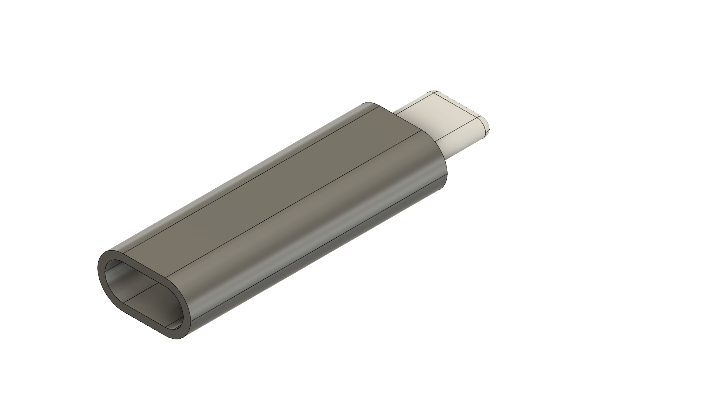

# How to fix a broken USB-C dongle on a Lenovo 65W Type C Charger

This repository contains all the information you need to fix a broken USB-C dongle on a Lenovo 65W Type C Charger.

## Wiring

The Lenovo 65W Type C Charger uses a total of 3 wires for the USB-C dongle: VBUS, GND and CC1. The VBUS and GND wires are used to power the USB-C device, while the CC1 wire is used to negotiate the power delivery.

Credits: https://superuser.com/questions/1770303/replace-male-usb-c-plug-in-lenovo-charger-cable

## Selecting a replacement USB-C dongle

The original USB-C dongle on the Lenovo 65W Type C Charger explicitly exposes the VBUS, GND and CC1 connections. Here's the nasty PCB left over from the broken original USB-C dongle

Unfortunately, most available USB-C dongles for soldering only expose the VBUS, D+, D- and GND connections. That being said, there's a simple hack to make them work as you'll see in the next section. For our fix we used the following USB-C dongle: www.aliexpress.com/item/1005005462430598.html

## Fixing the replacement USB-C dongle

Typically these solderable USB-C dongles have have a resistor (here marked R2) on the bottom side of the PCB that bridges VCC and CC1.

We can desolder this resistor and solder the blue wire onto the resistor's footprint instead. In addition to this, we need to cut the trace that connects one of the resistor's pad to VCC. The illustration below shows the necessary modifications:

## Soldering the USB-C dongle to the charger

On the "top" side, solder the shielding to the G(ND) pad, the red wire to the V(BUS) pad. On the bottom side, solder the blue wire to the pads for R2.

Make sure that there's no risk of short-circuiting the VBUS and GND wires. This can happen easily since the shielding is completely exposed.

## Enclousure

Self-soldered dongles can break pretty easily. To relieve the mechanical stress on the solder joints and wires, we created a 3D printable enclosure. The 3MF files are included in this project's repository.

One version has the "TU-DO" label on it, the other one is blank.

## Label

We also created a label with a QR code that links to this repository. This way, if the dongle breaks, the user can easily find the instructions to fix it!

The SVG and PDF files for the label are also included in this project's repository.